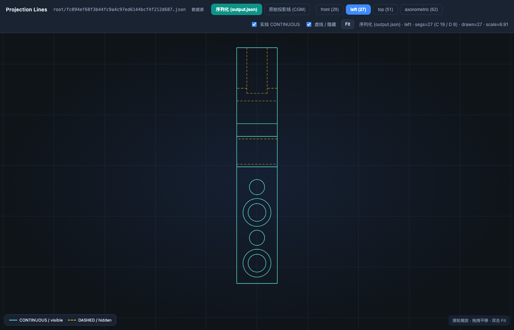

# 完整案例教程：从排查到上线（Skill × 提示词）

本文用一条**真实已修过的 case**，按对话顺序走完「排查 → 修复 → 发包 → 服务发版 → Jenkins 部署」。  
每一步写清：**你怎么说（提示词）→ Agent 用哪个 Skill → 这个 Skill 干什么 → 这一步实际在做什么**。

> 文中提示词可直接复制改 case；版本号 / tag 请换成你当时指定的值。

---

## 0. 背景：这条 Case 是什么

| 项 | 内容 |
|----|------|
| 现象 | 左视图某个孔在前端只画成 3/4 圆，缺一截 |
| 输入 | `root/fc894ef68f3b44fc9a4c97ed6144bcf4f212d687.json` |
| 根因（事后） | 序列化整圆时 `endAngle=449.999976`（浮点），前端整圆判定失败 |
| 修复点 | `dodimension/projection/filtered_curve/util.py`（近整圆 snap 到 `start+360`） |
| 知识库 id | `2026-07-04-hole-arc-endangle-float-three-quarter-circle` |

下文按「当时还不知道根因」的视角写对话，而不是事后复盘口吻。

---

## Skill 速览（本文会用到的）

| Skill | 属于 | 一句话 |
|-------|------|--------|
| `debug-parametric` | debug | 挂 case、跑 `test_parametric`、定位根因、修完复跑验证 |
| `debug-case-kb` | debug | 查历史相似案例；你要求时归档 / 跑历史回归 |
| `viz-scene-faces` | debug | 投图后 OCC 窗口高亮斜面/倒角（本例可选） |
| `viz-projection-html` | debug（本地） | 投影线交互 HTML：序列化线 vs 原始边（本例很有用） |
| `parametric-regression` | debug | 修前采 baseline、修后对比是否有无关 diff（可选） |
| `commit-and-push` | deploy | 带类型前缀 commit → rebase upstream/dev → push origin/dev |
| `publish-package` | deploy | 指定版本号发 dodimension 到内部 PyPI |
| `algorithm-service-release` | deploy | 算法服务重建 release 分支并打 git tag |
| `jenkins-service-release` | deploy | Jenkins 构建镜像并部署 K8s（与 git 发版分开） |
| `hotfix-do-dimension` | deploy | 生产紧急：基于 service tag 的 hotfix（本例常规主线不用） |
| `deploy-do-env` | deploy | 新机器装 conda + OCC（环境已有则跳过） |

完整步骤总表见 [WORKFLOW.md](WORKFLOW.md)。

---

## 第一阶段：Debug

### 步骤 1 — 挂 case 并复现排查

**你的提示词：**

```text
/debug-parametric
前端左视图有个孔只显示 3/4 圆，缺右下象限。
case：root/fc894ef68f3b44fc9a4c97ed6144bcf4f212d687.json
先复现，定位根因，先不要改代码。
```

**使用的 Skill：`debug-parametric`**

| | |
|--|--|
| **干什么** | do_dimension 参数化投图/标注问题的标准排查流程：确认 `input_json` → `py12` 跑 `scripts/test_parametric.py` → 按报错/卡住/结果不对分流定位 → **默认只报根因，不擅自修代码**。 |
| **会顺带做** | 排查前自动走一遍 `debug-case-kb` 检索（见步骤 1b）。投图成功后默认导出场景调试 HTML（Features / Relations）。 |
| **环境** | `conda activate py12`，仓库 `do_dimension`。 |

**Agent 实际动作（摘要）：**

1. 在 `test_input_file_oss_address()` **末尾追加**一行该 `root/...json`（保留历史注释）。
2. 报告当前生效 case。
3. 后台跑 `python scripts/test_parametric.py`，盯日志。
4. 对照序列化 output：找到孔 `ppEbRZsx` 的 `endAngle=449.999976`。

**你期望听到的结论形态：**

- 根因：哪个文件、为什么浮点导致前端只画 270°
- 证据：字段值 / 日志 / 与整圆判定逻辑的关系
- 建议：修序列化 snap，而不是前端兜底

---

### 步骤 1b — 排查前查历史（通常自动，也可手动）

**自动：** 只要走了 `/debug-parametric`，Agent 应先检索知识库。  
**手动提示词（可选）：**

```text
/debug-case-kb
之前有没有孔投影整圆、endAngle、3/4 圆这类问题？
```

**使用的 Skill：`debug-case-kb`**

| | |
|--|--|
| **干什么** | 维护/查询 `do_debug_case_graph`（本地 `debug_memory`）：`search` / `show` / 归档 / `regress`。 |
| **纪律** | 检索可自动；**归档和 regress 必须你口头要求**，否则不做。 |
| **查法** | `python $KB/tools/debug_kb.py search 孔 endAngle 整圆` 等，命中只看摘要，相关再 `show`。 |

本例若当时库里已有「互补半圆 dedupe」等相似记录，会作为线索提示，但仍要以本次复现为准。

---

### 步骤 2 —（可选）可视化投影线，确认是序列化问题

**你的提示词：**

```text
用 viz-projection-html 把这个 case 的投影线可视化一下，
对比一下序列化 output 里的线和原始投影边，看看是不是序列化丢了/角度错了。
```

**使用的 Skill：`viz-projection-html`**（装在 `~/.cursor/skills/`，当前不在 agent-config 仓内）

| | |
|--|--|
| **干什么** | 对指定 case 跑参数化投图，生成可交互 HTML：切换查看序列化 `projectionLines` vs CGM/OCC 原始投影边。 |
| **何时用** | 怀疑「线丢了、重叠、整圆变半圆/3/4 圆」等**画线/序列化**问题，而不是纯 3D 特征识别。 |
| **本例产物** | 见下方「本例实际生成的 HTML」。 |

#### 本例实际生成的 HTML（`viz-projection-html`）

已对 `root/fc894ef68f3b44fc9a4c97ed6144bcf4f212d687.json` 实跑投图并构建，产物在仓库内：

| 文件 | 说明 |
|------|------|
| [examples/.../viz_projection_viewer.html](examples/2026-07-04-hole-arc-endangle/viz_projection_viewer.html) | **可交互 HTML**（默认左视图；顶栏切换「序列化」↔「原始 CGM」） |
| [examples/.../viz_projection_viewer_left.png](examples/2026-07-04-hole-arc-endangle/viz_projection_viewer_left.png) | 打开 HTML 后的截图（方便在 GitHub 预览） |
| [examples/.../README.md](examples/2026-07-04-hole-arc-endangle/README.md) | 生成命令与线段统计 |

**预览（左视图 · 序列化源）：**



本地打开交互页：

```bash
open ~/agent-config/examples/2026-07-04-hole-arc-endangle/viz_projection_viewer.html
```

在页面里建议：

1. 确认 case 栏是 `root/fc894e…json`，视图选 **left**
2. 切换 **序列化 (output.json)** ↔ **原始投影线 (CGM)**，看孔圆是否一致/缺段
3. 结合 `output.json` 里同孔弧的 `startAngle` / `endAngle`（本例重跑时仍可见 `endAngle≈449.9999999` 一类浮点）

**对照：若怀疑是斜面/倒角面识别，** 换提示词：

```text
/viz-scene-faces
把这个 case 的斜面和倒角高亮看一下。
```

→ Skill **`viz-scene-faces`**：投图后弹 OCC 窗口（斜面绿 / 倒角红）；关窗即结束。本例根因在弧角度序列化，**投影线 HTML 更对口**；OCC 面高亮对本症状帮助不大，故未收录截图。

---

### 步骤 3 —（可选）修之前采回归 baseline

**你的提示词：**

```text
/parametric-regression
这次要改序列化，修之前先随机采 5 个生产 case 做 baseline，
seed 用 42。
```

**使用的 Skill：`parametric-regression`**

| | |
|--|--|
| **干什么** | 从 DTF（或 `test_parametric` 池）抽样 → 修前 `baseline` 跑批 → 修后再跑 → `compare_outputs` 查**与本次修复无关**的特征/语义/标注变化。 |
| **何时用** | 改动可能波及公共序列化 / 投影过滤逻辑，担心误伤其它件。 |
| **注意** | 回归脚本会关场景 HTML 导出，加快批量。 |

不担心面时可以跳过，直接修 + 同 case 验证。

---

### 步骤 4 — 明确要求修复并复跑本 case

**你的提示词：**

```text
按刚才的根因修：整圆导出时把 endAngle snap 到 start+360，
不要用 try/except 掩盖。修完用同一个 root/fc894e… case 再跑一遍验证。
```

**使用的 Skill：仍是 `debug-parametric`（修复纪律段）**

| | |
|--|--|
| **干什么（修代码时）** | 只改根因相关代码；禁止吞异常/过滤脏数据冒充修好；修完**必须同 case 复跑**并报告结果。 |
| **本例结果** | `ppEbRZsx` 的 `endAngle` 变为 `450.0`；前端整圆判定通过。 |

---

### 步骤 5 —（可选）修后回归对比

**你的提示词：**

```text
/parametric-regression
用刚才同一个 pool 跑 after，对比有没有无关 diff。
```

**Skill：** 仍是 **`parametric-regression`**（步骤 3 的后半段）。

---

### 步骤 6 — 归档案例到知识库

**你的提示词：**

```text
/debug-case-kb 归档本次问题
把症状、根因、fix commit、test_cases 都写上，push 到远端。
```

**使用的 Skill：`debug-case-kb`（归档模式）**

| | |
|--|--|
| **干什么** | 按模板新建 `cases/YYYY-MM-DD-*.md` → `debug_kb.py check` → 在 `debug_memory` 仓 commit → **自动 `git push origin main`**。 |
| **为何要你开口** | 避免每条闲聊排查都污染知识库；只有你认为「值得以后搜」才归档。 |

归档后可用 id：`2026-07-04-hole-arc-endangle-float-three-quarter-circle`。

---

## 第二阶段：合入与发包（dev 主线）

### 步骤 7 — 提交并推到 origin/dev

**你的提示词：**

```text
/commit-and-push
把这次孔整圆 endAngle snap 的修复提交并推上去。
```

**使用的 Skill：`commit-and-push`**

| | |
|--|--|
| **干什么** | 按前缀选类型（本例多为 `fix:`）→ commit → 无关改动 stash → `rebase upstream/dev` → `push origin dev` → **最后再** stash pop。 |
| **不干什么** | 不改版本号、不 PyPI 上传、不打服务 tag。 |

---

### 步骤 8 — 发布 dodimension 包

**你的提示词：**

```text
/publish-package
发包，版本号是 0.3.6.13
```

（版本号必须你指定；没有就 Agent 会问，不会自己猜。）

**使用的 Skill：`publish-package`**

| | |
|--|--|
| **干什么** | stash `--all` 清空工作区 → rebase `upstream/dev` → 改 `pyproject.toml` + `dodimension/__init__.py` 版本 → 内部再走 **`commit-and-push`** → `python -m build` + twine 上传内部 PyPI → 钉钉通知 → 全程结束再 stash pop。 |
| **依赖** | 版本号四段式且大于当前；任一步失败即停，不带病上传。 |

---

## 第三阶段：服务发版与部署

> 前提：投图服务依赖的 `dodimension` 版本已在内部 PyPI 可装（步骤 8 完成），且服务仓已按需 bump 依赖（若你们流程里在 service 仓改 requirements，按团队惯例来）。

### 步骤 9 — 算法服务 git release + tag

**你的提示词：**

```text
/algorithm-service-release
算法服务更新，tag v1.2.0
在 service_auto_dimension 仓库做。
```

**使用的 Skill：`algorithm-service-release`**

| | |
|--|--|
| **干什么** | 同步 `upstream/dev` → 删旧 release 分支并重建 → 推到 origin/upstream → 打你指定的 **annotated tag** 并推送。 |
| **注意** | tag 必须你给（如 `v1.2.0`）；这是 **git 发版**，还不部署到 K8s。 |

---

### 步骤 10 — Jenkins 构建镜像并部署

**你的提示词：**

```text
/jenkins-service-release
投图服务发到预生产。
```

**使用的 Skill：`jenkins-service-release`**

| | |
|--|--|
| **干什么** | 调 Jenkins Job `build_general_service_image`：构建镜像 + 部署 K8s。**不操作 git**，与步骤 9 分开。 |
| **本例映射** | 「投图服务」→ `ai-python-auto-dimension` + `ai-python-auto-dimension-part`；「预生产」→ `profile=production`，`branch=release`。 |

其它说法对照：

| 你说 | 效果 |
|------|------|
| 数据处理服务发算法重构 | stp-convert；`suanfa` + `dev` |
| drawing2d 发预发版 | drawing 前端 + node-queue；production/release |
| cgm 服务发预生产 | do-cgm |

---

## 对话时间线（可当检查清单）

```text
你: /debug-parametric … case root/fc894e… 先定位别改代码
    → Skill: debug-parametric (+ 自动 debug-case-kb 检索)

你: （可选）用 viz-projection-html 看投影线
    → Skill: viz-projection-html

你: （可选）/parametric-regression 先采 baseline
    → Skill: parametric-regression

你: 按根因修，同 case 再跑
    → Skill: debug-parametric

你: （可选）回归 after 对比
    → Skill: parametric-regression

你: /debug-case-kb 归档本次问题
    → Skill: debug-case-kb

你: /commit-and-push
    → Skill: commit-and-push

你: /publish-package 版本号 0.3.6.13
    → Skill: publish-package

你: /algorithm-service-release tag v1.2.0
    → Skill: algorithm-service-release

你: /jenkins-service-release 投图服务发预生产
    → Skill: jenkins-service-release
```

---

## 分支剧情 A：只要排查结论，不上线

停在步骤 1（+ 可选可视化）即可。  
**不要说**「修一下 / 提交 / 发包」，Agent 按纪律只报根因。

---

## 分支剧情 B：生产着火，走 Hotfix

若线上已是旧包、不能等完整 dev 发包周期：

**提示词：**

```text
/hotfix-do-dimension
线上投图服务这个孔 3/4 圆，按刚才根因做火线修复，
需要的话一并发包。
```

**Skill：`hotfix-do-dimension`**

| | |
|--|--|
| **干什么** | 读 `service_auto_dimension` 最新 tag 上的 do_dimension 版本 → 在对应 hotfix 分支 cherry-pick / 修 → 五段修订版本号 → 推 origin/upstream → 可选 PyPI。 |
| **之后上线** | 仍要你再触发 `algorithm-service-release` + `jenkins-service-release`（或按现网 hotfix 发布规范）。 |

常规主线用步骤 7–10，不要和 hotfix 混用同一套说法。

---

## 分支剧情 C：新电脑没有环境

**提示词：**

```text
/deploy-do-env
帮我建一个叫 py12 的 conda 算法环境。
```

**Skill：`deploy-do-env`** — 创建 python3.12 + pythonocc、装 pytorch、配内部 PyPI、装 do_dimension `requirement.txt`。  
装好后再从步骤 1 开始。

---

## 常见提示词速查

| 目的 | 提示词骨架 |
|------|------------|
| 排查 | `/debug-parametric` + 症状 + `root/….json` +「先不要改代码」 |
| 查历史 | `/debug-case-kb` + 关键词 / 症状 |
| 看投影线 | `用 viz-projection-html …` |
| 看斜面倒角 | `/viz-scene-faces` |
| 回归 | `/parametric-regression` + baseline / after |
| 修复验证 | 「按根因修，同 case 再跑」 |
| 归档 | `/debug-case-kb 归档本次问题` |
| 推代码 | `/commit-and-push` |
| 发包 | `/publish-package` + **版本号** |
| 服务 tag | `/algorithm-service-release` + **tag** |
| K8s | `/jenkins-service-release` + **服务** + **环境** |
| 火线 | `/hotfix-do-dimension` |
| 装环境 | `/deploy-do-env` |

---

## 相关文件

| 文件 | 内容 |
|------|------|
| [WORKFLOW.md](WORKFLOW.md) | 步骤 × skill 总表（无长文举例） |
| [catalog.yaml](catalog.yaml) | skill 分类与路径 |
| [examples/2026-07-04-hole-arc-endangle/](examples/2026-07-04-hole-arc-endangle/) | **本例** `viz-projection-html` 生成的 HTML + 截图 |
| `~/agent-config/skills/debug/*` | debug 类 skill 正文 |
| `~/agent-config/skills/deploy/*` | deploy 类 skill 正文 |
